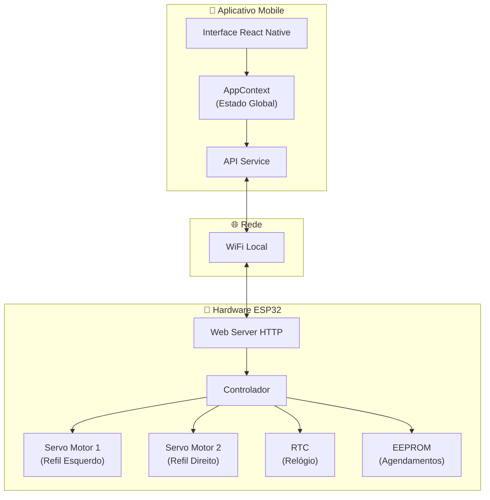
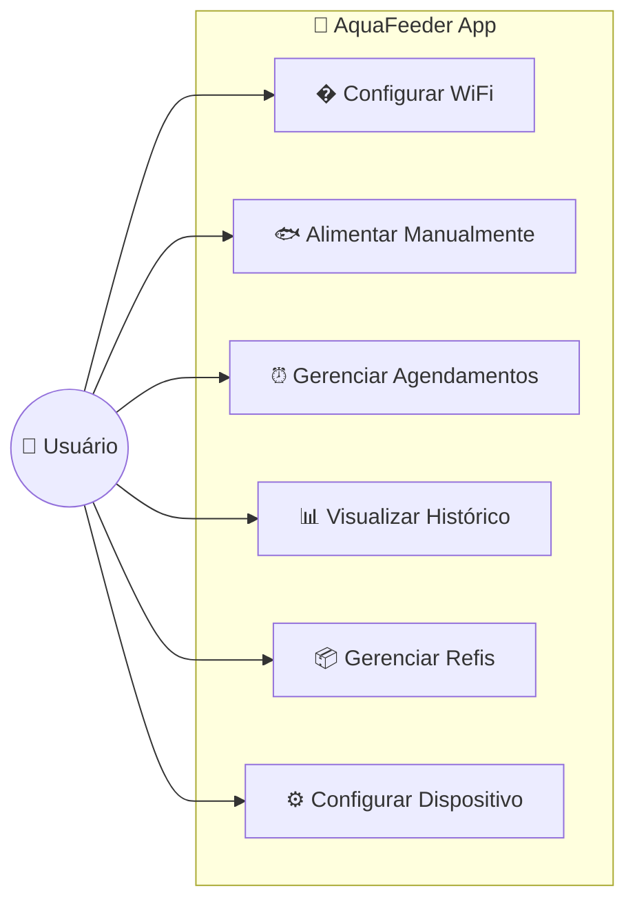
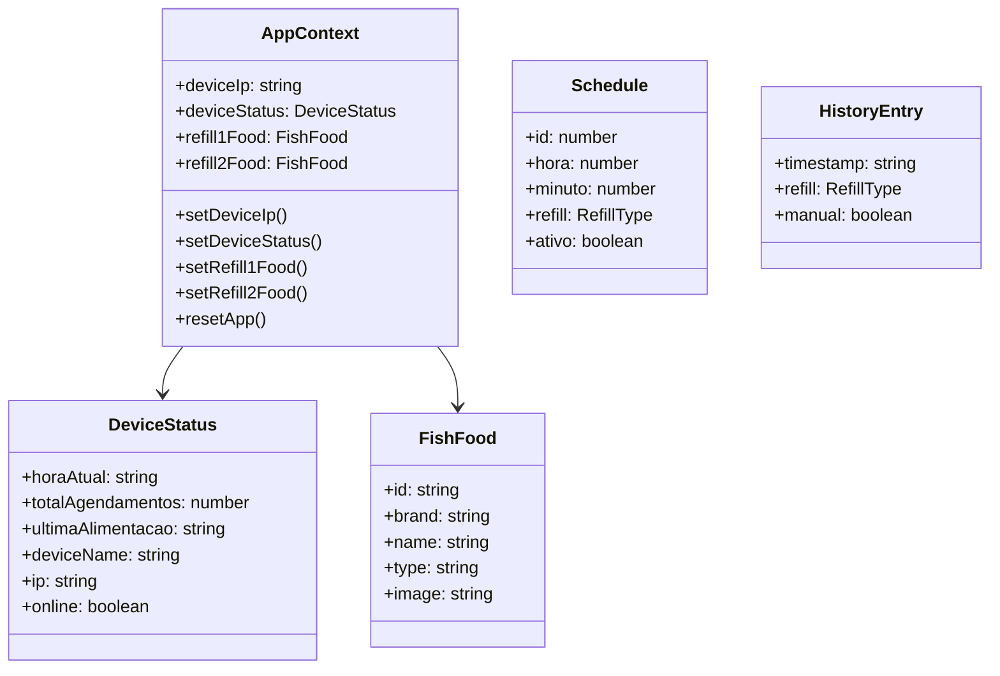
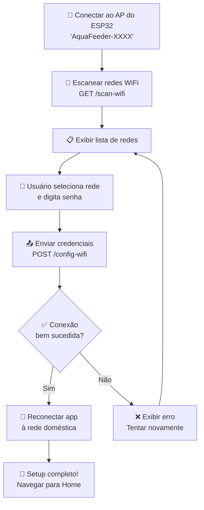
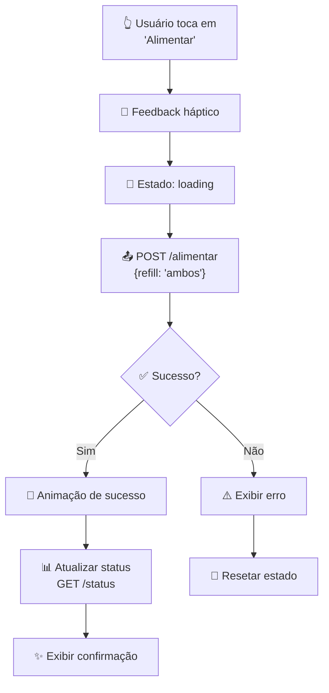
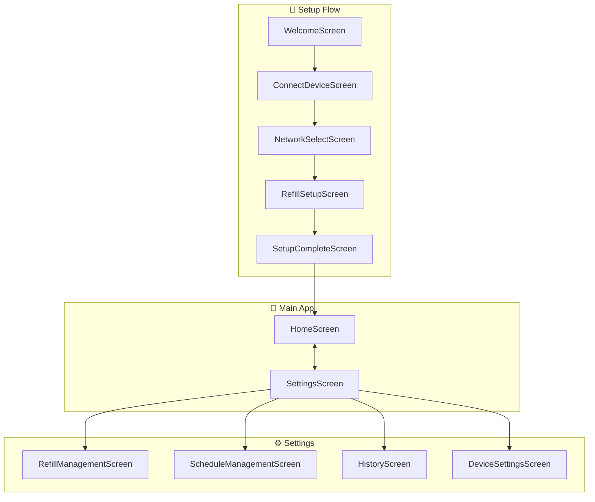
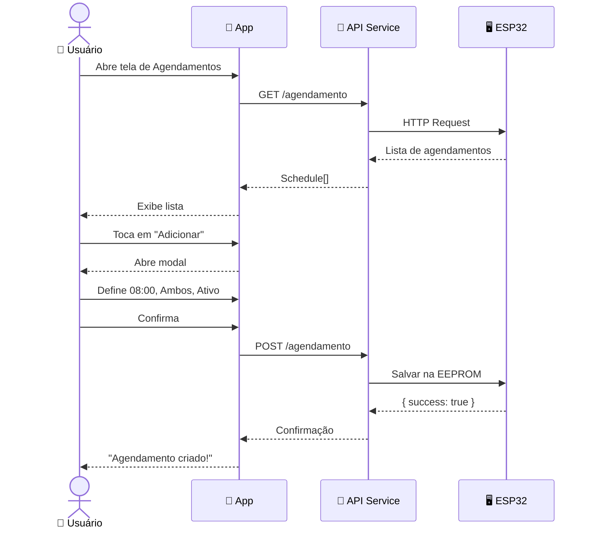

# 🐟 AquaFeeder

<p align="center">
  
  
  
  
</p>

<p align="center">
  <strong>Aplicativo React Native para controlar um alimentador automático de peixes via ESP32</strong>
</p>

---

## 📋 Índice

- [Visão Geral](#-visão-geral)
- [Funcionalidades](#-funcionalidades)
- [Arquitetura do Sistema](#-arquitetura-do-sistema)
- [Diagramas](#-diagramas)
- [Estrutura do Projeto](#-estrutura-do-projeto)
- [API do ESP32](#-api-do-esp32)
- [Instalação](#-instalação)
- [Tecnologias](#-tecnologias)
- [Componentes](#-componentes)
- [Licença](#-licença)

---

## 🎯 Visão Geral

O **AquaFeeder** é um sistema IoT completo para automação de alimentação de peixes, composto por:

1. **Hardware**: ESP32 com servo motores para dispensar ração
2. **Aplicativo Mobile**: Interface React Native/Expo para controle remoto
3. **Comunicação**: API REST via WiFi local

O sistema permite alimentação manual, agendamentos automáticos e monitoramento do histórico, tudo através de uma interface elegante com tema aquático.

---

## ✨ Funcionalidades

| Funcionalidade | Descrição |
|----------------|-----------|
| 🔧 **Setup WiFi** | Configuração da rede doméstica via modo AP do ESP32 |
| 🐠 **Alimentação Manual** | Botões para alimentar ambos os refis ou individualmente |
| ⏰ **Agendamentos** | Até 10 horários automáticos configuráveis |
| 📊 **Histórico** | Registro de todas as alimentações com data/hora |
| 🎛️ **Gerenciamento de Refis** | Cadastro de rações específicas por refil |
| 📱 **Design Premium** | Interface escura elegante com animações suaves |
| 🔔 **Feedback Háptico** | Vibrações táteis em todas as interações |

---

## 🏛️ Arquitetura do Sistema



---

## 📊 Diagramas

### Diagrama de Caso de Uso



### Diagrama de Classes



### Diagrama de Fluxo - Setup WiFi



### Diagrama de Fluxo - Alimentação



### Diagrama de Navegação



### Diagrama de Sequência - Agendamento



---

## 📁 Estrutura do Projeto

```
fish-feeding-app/
├── 📄 App.tsx                    # Entry point
├── 📄 app.json                   # Configurações Expo
├── 📄 package.json               # Dependências
├── 📄 tsconfig.json              # Config TypeScript
│
├── 📁 src/
│   ├── 📁 components/
│   │   └── 📁 common/
│   │       ├── AnimatedCard.tsx      # Card com animações
│   │       ├── AnimatedModal.tsx     # Modal com blur glass
│   │       ├── AnimatedStatusDot.tsx # Indicador pulsante
│   │       ├── Button.tsx            # Botão estilizado
│   │       ├── Card.tsx              # Card base
│   │       ├── GradientView.tsx      # View com gradiente
│   │       ├── Header.tsx            # Header de navegação
│   │       ├── Input.tsx             # Input estilizado
│   │       ├── PulseButton.tsx       # Botão principal pulsante
│   │       ├── SkeletonLoader.tsx    # Loading skeleton
│   │       └── index.ts              # Exports
│   │
│   ├── 📁 contexts/
│   │   └── AppContext.tsx            # Estado global
│   │
│   ├── 📁 data/
│   │   └── fishFoods.json            # Base de rações
│   │
│   ├── 📁 navigation/
│   │   └── AppNavigator.tsx          # Rotas
│   │
│   ├── 📁 screens/
│   │   ├── HomeScreen.tsx            # Tela principal
│   │   ├── 📁 setup/
│   │   │   ├── WelcomeScreen.tsx
│   │   │   ├── ConnectDeviceScreen.tsx
│   │   │   ├── NetworkSelectScreen.tsx
│   │   │   ├── RefillSetupScreen.tsx
│   │   │   └── SetupCompleteScreen.tsx
│   │   └── 📁 settings/
│   │       ├── SettingsScreen.tsx
│   │       ├── RefillManagementScreen.tsx
│   │       ├── ScheduleManagementScreen.tsx
│   │       ├── HistoryScreen.tsx
│   │       └── DeviceSettingsScreen.tsx
│   │
│   ├── 📁 services/
│   │   └── api.ts                    # Comunicação HTTP
│   │
│   ├── 📁 styles/
│   │   ├── colors.ts                 # Paleta de cores
│   │   └── theme.ts                  # Espaçamentos, fontes
│   │
│   ├── 📁 types/
│   │   └── index.ts                  # Tipos TypeScript
│   │
│   └── � utils/
│       └── animations.ts             # Funções de animação
│
└── 📁 assets/
    ├── adaptive-icon.png
    ├── favicon.png
    ├── icon.png
    └── splash-icon.png
```

---

## 🔌 API do ESP32

### Endpoints

| Endpoint | Método | Descrição | Body/Params |
|----------|--------|-----------|-------------|
| `/status` | GET | Status do dispositivo | - |
| `/alimentar` | POST | Aciona alimentação | `{ refill: "ambos" \| "refill1" \| "refill2" }` |
| `/agendamento` | GET | Lista agendamentos | - |
| `/agendamento` | POST | Cria agendamento | `{ hora, minuto, refill, ativo }` |
| `/agendamento/:id` | PUT | Atualiza agendamento | `{ hora, minuto, refill, ativo }` |
| `/agendamento/:id` | DELETE | Remove agendamento | - |
| `/historico` | GET | Histórico de alimentações | - |
| `/scan-wifi` | GET | Escaneia redes WiFi | - |
| `/config-wifi` | POST | Configura WiFi | `{ ssid, password }` |
| `/network-info` | GET | Info da conexão atual | - |
| `/config` | PUT | Atualiza configurações | `{ deviceName, ... }` |

### Exemplos de Resposta

#### GET /status
```json
{
  "horaAtual": "14:32:15",
  "totalAgendamentos": 3,
  "refill1Nome": "Tetra ColorBits",
  "refill2Nome": "Sera Vipan",
  "ultimaAlimentacao": "2026-01-08T12:00:00Z",
  "deviceId": "ESP32-AquaFeeder",
  "deviceName": "Aquário Sala",
  "ip": "192.168.1.100",
  "maxAgendamentos": 10
}
```

#### GET /agendamento
```json
{
  "agendamentos": [
    { "id": 1, "hora": 8, "minuto": 0, "refill": "ambos", "ativo": true },
    { "id": 2, "hora": 18, "minuto": 30, "refill": "refill1", "ativo": true }
  ]
}
```

#### GET /historico
```json
{
  "historico": [
    { "timestamp": "2026-01-08T08:00:00Z", "refill": "ambos", "manual": false },
    { "timestamp": "2026-01-07T15:30:00Z", "refill": "refill2", "manual": true }
  ]
}
```

---

## � Instalação

### Pré-requisitos

- Node.js 18+
- npm ou yarn
- Expo CLI
- Expo Go app no celular (iOS/Android)

### Passos

```bash
# 1. Clone o repositório
git clone https://github.com/pattchvs/alimentador-peixes.git

# 2. Entre na pasta
cd alimentador-peixes

# 3. Instale as dependências
npm install

# 4. Inicie o projeto
npx expo start
```

Escaneie o QR code com o **Expo Go** para testar no celular.

### Variáveis de Ambiente

O app detecta automaticamente o IP do ESP32 durante o setup. Não são necessárias variáveis de ambiente adicionais.

---

## 🛠️ Tecnologias

| Tecnologia | Uso |
|------------|-----|
| **React Native** | Framework mobile cross-platform |
| **Expo** | Toolchain e build |
| **TypeScript** | Tipagem estática |
| **React Navigation** | Navegação entre telas |
| **AsyncStorage** | Persistência local |
| **Expo Haptics** | Feedback tátil |
| **Expo Blur** | Efeito glassmorphism |
| **Expo Linear Gradient** | Gradientes de fundo |
| **React Native Animated** | Animações nativas |

---

## 🧩 Componentes

### Componentes de Interface

| Componente | Descrição |
|------------|-----------|
| `PulseButton` | Botão principal com animação de pulsação e glow |
| `AnimatedCard` | Card com fade-in e scale-on-press |
| `AnimatedModal` | Bottom sheet com blur de fundo |
| `AnimatedStatusDot` | Indicador online com ring pulsante |
| `SkeletonLoader` | Placeholder com shimmer durante loading |
| `Button` | Botão estilizado com variantes |
| `Card` | Container com sombra e bordas |
| `Header` | Cabeçalho com navegação |
| `Input` | Campo de texto estilizado |

### Utilitários de Animação

```typescript
// src/utils/animations.ts
fadeIn(animValue, duration)      // Fade in
fadeOut(animValue, duration)     // Fade out
scaleDown(animValue, toValue)    // Escala para baixo
scaleUp(animValue)               // Escala para cima
createPulseAnimation(animValue)  // Loop de pulsação
createGlowAnimation(animValue)   // Loop de brilho
createShimmerAnimation(animValue)// Loop de shimmer
slideUp(animValue)               // Slide para cima
slideDown(animValue)             // Slide para baixo
staggeredFadeIn(values, delay)   // Fade escalonado
springBounce(animValue)          // Bounce com spring
```

---

## 🎨 Design System

### Paleta de Cores

```
Primary:    #00D9FF (Cyan aquático)
Secondary:  #00FF88 (Verde neon)
Accent:     #FF6B35 (Laranja coral)
Background: #0A0F1C (Azul escuro profundo)
Surface:    #141B2D (Azul petróleo)
Text:       #FFFFFF (Branco)
TextMuted:  #6B7280 (Cinza)
```

### Tipografia

- **Títulos**: System font, bold, 24-32px
- **Corpo**: System font, regular, 14-16px
- **Labels**: System font, semibold, 10-12px, uppercase

### Espaçamento

```
xs:  4px   | sm:  8px
md: 12px   | lg: 16px
xl: 24px   | xxl: 32px
```

---

## 📄 Licença

MIT © Patrick Chaves

---

<p align="center">
  Feito com ❤️ para aquaristas
</p>

<p align="center">
  <a href="https://github.com/pattchvs">@pattchvs</a>
</p>
